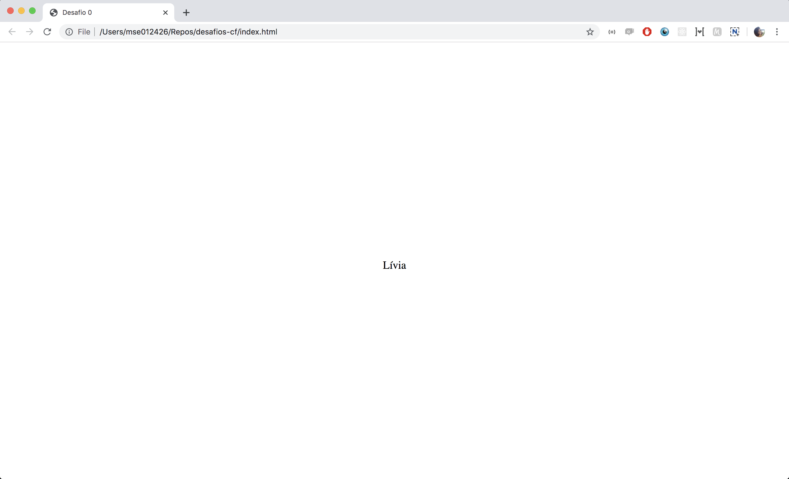

No primeiro exercício vamos escrever nosso nome centralizado na tela. Parece bobo, mas um dos maiores desafios do CSS é centralizar os elementos! O objetivo final é construir uma página assim:

Para isso,
1. crie um arquivo com a estrutura HTML e um arquivo com os estilos.
2. Importe o arquivo CSS no seu HTML.  
3. Inclua um elemento no body que conterá o texto com o seu nome
4. Altere os estilos para que seu nome fique centralizado

Happy coding!
